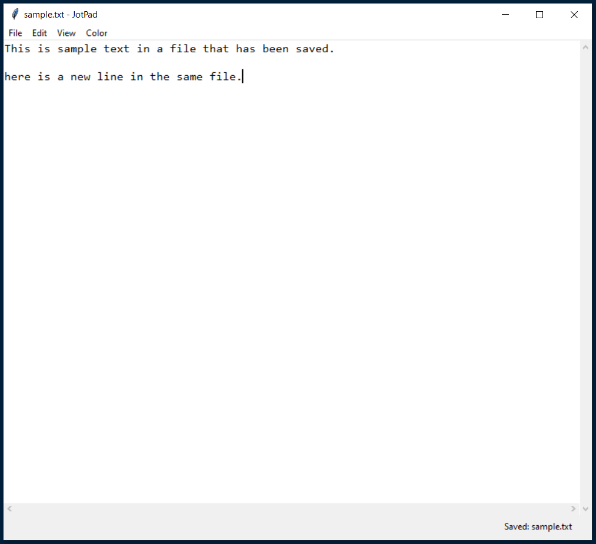
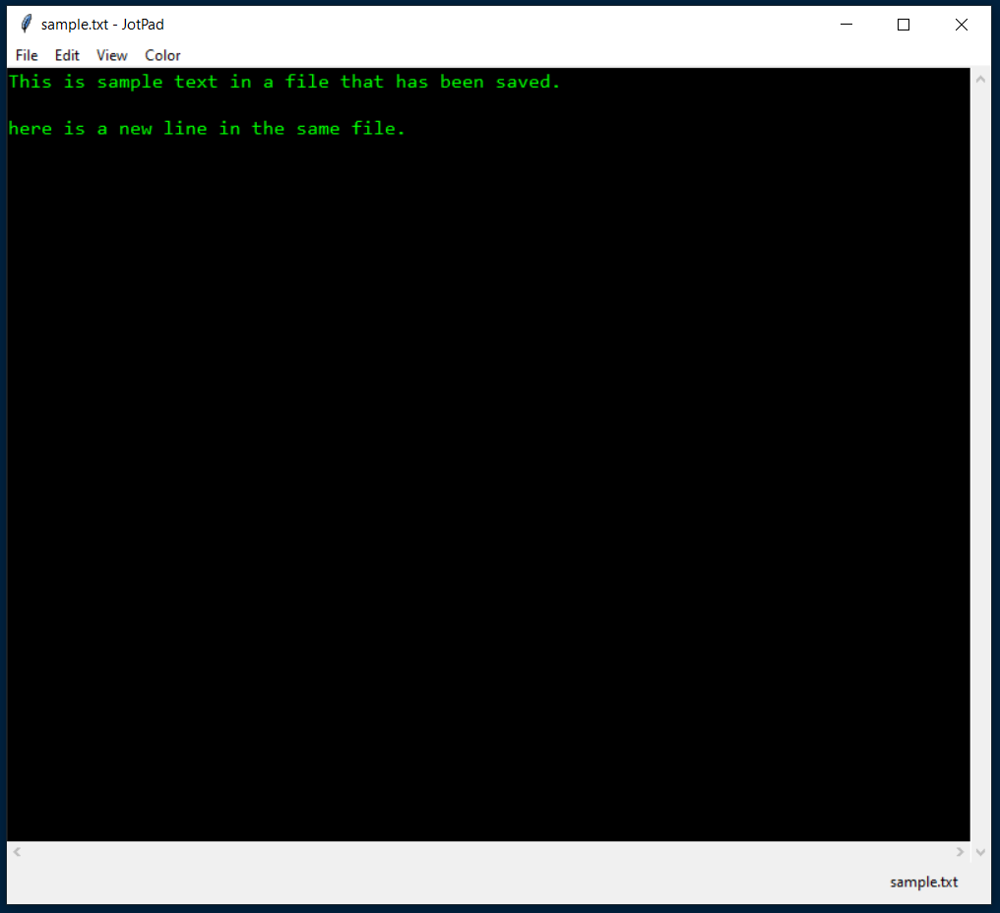
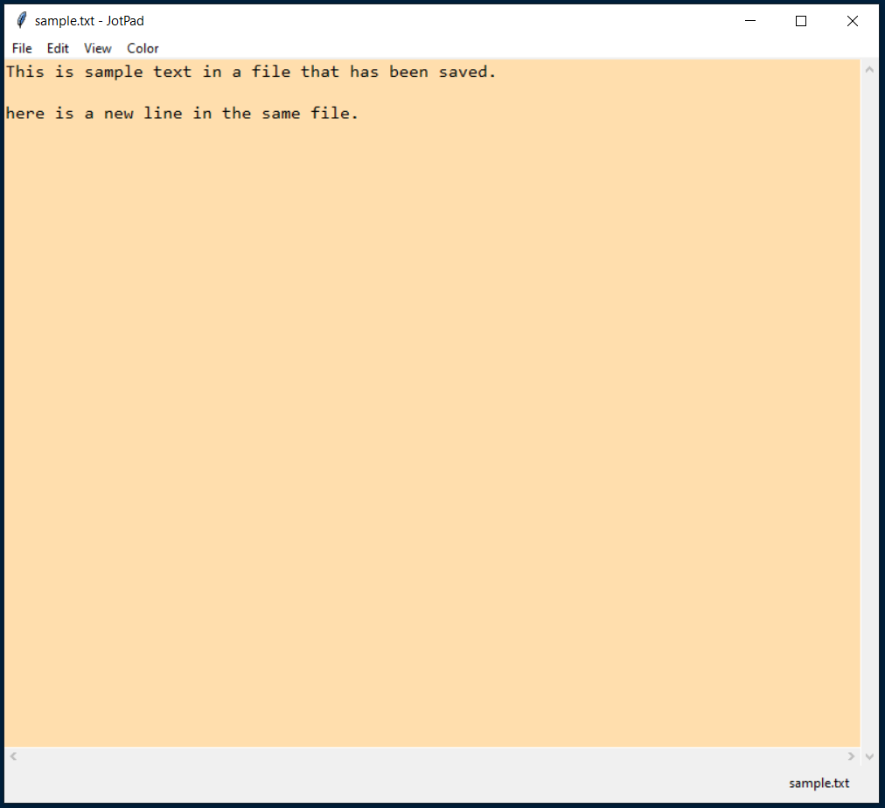

# Text-Editor_Python
A simple text editor that is at similar functioning level to Windows 10 Notepad. The inspiration of this personal project came from the
[Codemy TKinker Playlist](https://www.youtube.com/watch?v=yQSEXcf6s2I&list=PLCC34OHNcOtoC6GglhF3ncJ5rLwQrLGnV) on Youtube.

 - - - -

### Pictures:

#### Default Look

#### Night 1 Theme

#### Night 2 Theme

#### Parchment Theme

